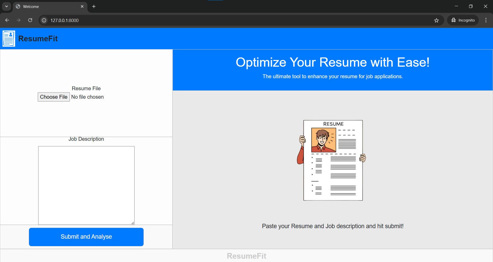
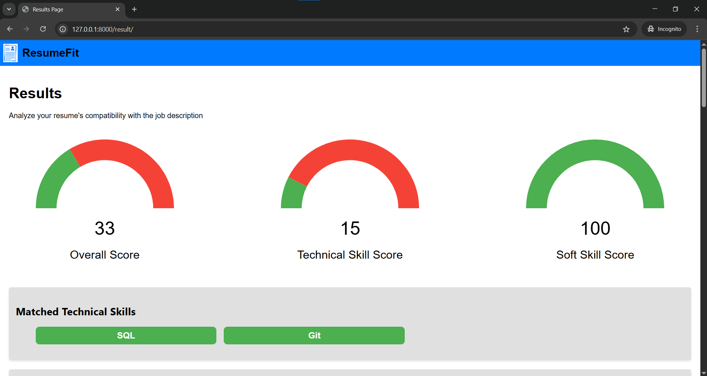
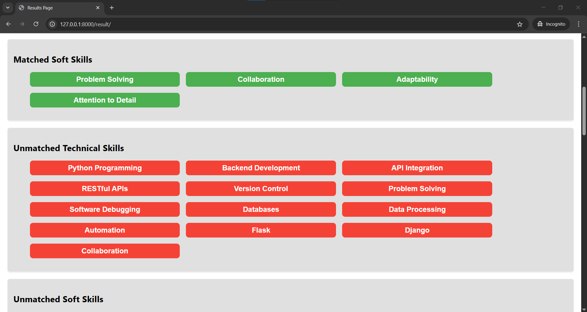
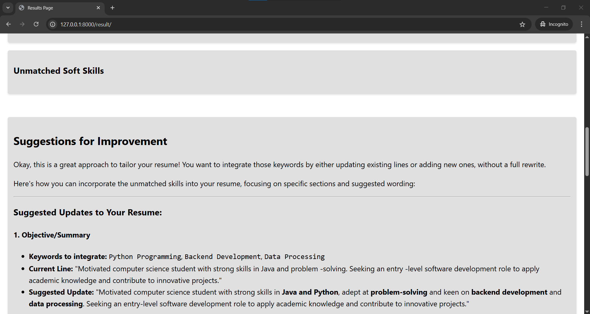
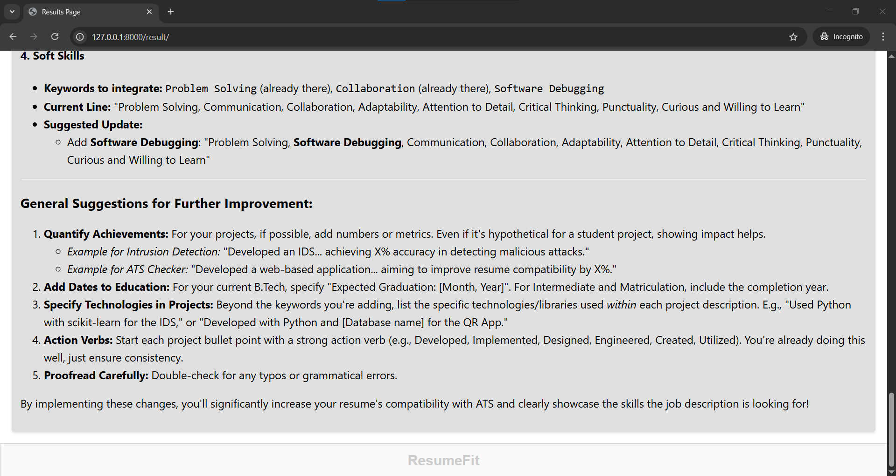

# 💼 ResumeFit – AI-Powered ATS Resume Analyzer

> Optimize your resume. Improve your match. Get noticed.

---
## ✨ Abstract

ResumeFit is an AI-powered resume analysis *web-based* application that compares uploaded resumes with job descriptions and provides personalized, data-driven suggestions. Designed especially for students and early-career job seekers, ResumeFit simulates ATS (Applicant Tracking System) behavior using NLP and AI.

---
## 🔍 Problem Statement

Many job seekers face challenges with:

- ❌ Poor keyword optimization
- ❌ Lack of job-specific tailoring
- ❌ Unidentified skill gaps
- ❌ Rejections due to ATS incompatibility

ResumeFit addresses these with intelligent resume analysis, skill matching, and feedback generation.

---
## 🎯 Objectives

- ✅ Extract skills from resumes and job descriptions using NLP
- ✅ Classify skills into technical and soft
- ✅ Calculate match percentage using weight-based scoring
- ✅ Provide ATS-friendly formatting suggestions
- ✅ Help users identify skill gaps and grow professionally

---
## 🧰 Key Features

| Feature                        | Description                                        |
| ------------------------------ | -------------------------------------------------- |
| 📤 Resume Upload               | Upload PDF/TXT resumes for analysis                |
| 📝 JD Comparison               | Paste or upload a job description                  |
| 🧠 Skill Extraction            | Use NLP to extract and classify key skills         |
| 📊 Match Score                 | Weighted scoring to simulate ATS logic             |
| 🧾 Keyword Suggestions         | List of missing or underrepresented keywords       |
| 🧱 ATS Optimization            | Tips for improving resume formatting and structure |
| 📈 Career Development Insights | Highlight missing skills for long-term growth      |

---
## 🧪 Methodology

1. Upload resume and job description
2. Preprocess text (tokenize, normalize, lemmatize)
3. Extract keywords and skills (using spaCy, NLTK)
4. Classify skills into technical or soft (AI-based)
5. Match skills using weighted algorithm
6. Generate score and suggestions

---
## 🧠 Technologies Used

| Layer        | Tools & Technologies                                                                        |
| -------- | ------------------------------------------------------------------------------------------- |
| Frontend     | HTML5, CSS3, JavaScript                                                                     |
| Backend      | Django 5.1.3, Python 3.11+                                                                  |
| NLP & AI     | spaCy 3.8.4, NLTK 3.9.1, PyPDF2 3.0.1, Gemini Flash 2.5 (for AI-based Skill Classification) |
| Database     | SQLite3                                                                                     |
| Tools        | Git, VS Code, Render (Deployment-ready)                                                     |

---
## 📸 Screenshots

#### **Home Page**

#### **Result Page**

#### **Suggestions Section**

---
## 🚀 Getting Started

### Clone the repo
bash
git clone https://github.com/koushik122/ResumeFit-Resume-analyzer-using-AI.git
cd ResumeFit-Resume-analyzer-using-AI

### Create and activate virtual environment
bash
python -m venv venv
source venv/bin/activate   # On Windows: venv\Scripts\activate

### Install dependencies
bash
pip install -r requirements.txt

### Add Your Gemini API Key
To enable AI-based skill classification, create a file named api_cred.py inside the resume/ Django app directory with the following content:
python
api_key = "YOUR_GEMINI_API_KEY"

> [!important] Replace "YOUR_GEMINI_API_KEY" with your actual Gemini API key.

Also, ensure you add this file to .gitignore to avoid exposing your API key:
python
# Inside .gitignore
resume/api_cred.py

### Run the server
bash
python manage.py runserver

### Visit in your browser:
http://localhost:8000

---
## 📈 Future Enhancements

- 🔐 Add user login and dashboard
- 🤖 Smart resume rewriting suggestions using AI
- 📥 Downloadable resume templates
- 🌍 Multi-language interface
- 📊 Resume scoring leaderboard

---
## ⭐ Support This Project

If you found this project helpful:
- Give it a ⭐ on GitHub
- Share it with your friends
- Connect with us for feedback and collaboration

> "Make your resume shine with ResumeFit!"
